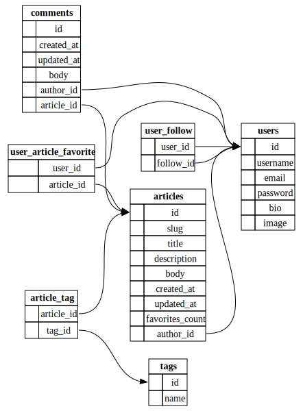

# 

> ### Wing codebase containing real world examples (CRUD, auth, advanced patterns, etc) that adheres to the [RealWorld](https://github.com/gothinkster/realworld) spec and API.

### [Demo](https://demo.realworld.io/)&nbsp;&nbsp;&nbsp;&nbsp;[RealWorld](https://github.com/gothinkster/realworld)

This codebase was created to demonstrate a fully fledged fullstack application built with **Wing** including CRUD operations, authentication, routing, pagination, and more.

We've gone to great lengths to adhere to the **Wing** community styleguides & best practices.

For more information on how to this works with other frontends/backends, head over to the [RealWorld](https://github.com/gothinkster/realworld) repo.

# How it works

[Wing](https://www.winglang.io/) + [libSQL](https://docs.turso.tech/libsql)

# Getting started

`wing it main.w`
